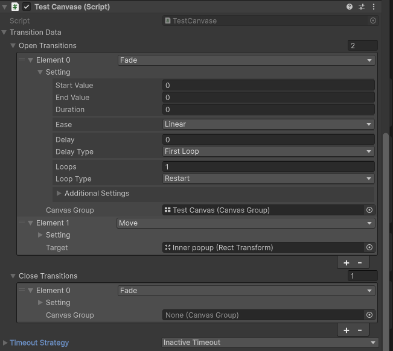

# About
Some template systems that in my opinion has 0 voodoo magic, easy to read and extend<br>
This aims for minimal overhead of monobehaviours, unity objects and no enum switches which makes the whole packages just a wrapper around some core interfaces with [System.Serializable] and [SerializeReference] for plain c# scripts

# Install
Add Git package URL: https://github.com/ducvg/DVG.git?path=Assets/_DVG/<br>
Auto install dependencies: UniTask, LitMotion (for included transitions), DVG.Common (Timer for timeout)<br>
Works with odin inspector<br>

# Contains
- [Audio](#Audio)
- [UI](#UI)
- [State Machine](#State-Machine)
- [Timer](#Timer)
- [Object Pool](#Object-Pool)

# Audio
Add AudioManager on a gameObject, this is a DontDestroyOnLoad Singleton wrap around audio controllers. Every controller implement IAudioController, add custom controller by create class implement this then assign on AudioManager inspector. 2 controllers prepared: SfxAudio and BackgroundAudio

To play a audio, call .Play on a controller and pass in an IAudioData. 2 AudioData prepared: SingleAudioData and RandomAudioData. Create custom by implement this interface then use normally.

Get a controller:
```csharp
[SerializeField] private SingleAudioData backgroundAudio; 
[SerializeField] private RandomAudioData shootSfx; 
...
AudioManager.Get<SfxAudio>.Play(shootSfx);
AudioManager.Get<BackgroundAudio>.Play(backgroundAudio);
```

Create a AudioData:
```csharp
[System.Serializable]
public sealed class CustomData : IAudioData
{...}
```

Create a AudioController:
```csharp
[System.Serializable]
public sealed class VoiceAudio : IAudioController
{...}
```
then assign the new voice audio controller on the audioManager inspector normally like others.

# UI
Add UIManager on a gameObject, this is a DontDestroyOnLoad Singleton wrap around all UI Canvases. Every canvas inherit from class BaseCanvas. <br>
**All Canvas needs to be prefab assigned on UIManager inspector** 

### Transtion
Canvas may or may not have open/close transition, to add transition: select the desired transitions on the canvas's obj inspector
**4 Transition included: Move, Fade, Rotate, Scale.**
<br> <br>
Multiple transitions will run same time which can be combined for various design desires.<br>
Creating custom transition:
```csharp
[System.Serializable]
public sealed class ParticleTranstion : ITransition
{
    ...

    public async UniTask Run(CancellationToken ct)
    {
        _particle.Play();
        while(_particle.IsRunning()) await UniTask.Yield(ct)
    }
    
    public void Complete()
    {
        _particle.Stop();
    }
}
```

### Usage
```csharp
UIManager.Open<InventoryCanvas>();
await UIManager.OpenAsync<InventoryCanvas>(); //wait all transition complete
UIManager.OpenImmediate<SettingCanvas>(); //immediately open without any transition;
```
```csharp
UIManager.Close<InventoryCanvas>();
await UIManager.CloseAsync<InventoryCanvas>(); //wait all transition complete
UIManager.CloseImmediate<SettingCanvas>(); //immediately close without any transition;

UIManager.CloseAll(); //same with .Close but for all active canvas
await UIManager.CloseAllAsync();
UIManager.CloseAllImmediate();
```
```csharp
GameplayCanvas gameCanvas = UIManager.GetCanvas<GameplayCanvas>(); //will open if canvas hasnt open before
UIManager.UnloadCanvas<MinigameCanvas>(); //destroy the pooled canvas and release reference to the canvas;
```

### Pool, Timeout
All canvas are pooled by default, it can be manally .Destroy(canvas.gameobject) with timeoutStrategy as Null or be auto with a Timeout Strategy (only InactiveTimout is included atm)<br>
Select a strategy to free up canvas that arent used frequently. The timer will tick (and destroy if finish) before script's Update() and reset time on open before any transition.<br>
Creating custom Timeout Strategy:
```csharp
[System.Serializable]
public sealed class CustomTimeout : ITimeout
{
    [SerializedField] private int _duration;
    Timer timer = new CountdownTimer(); //or coroutine, async await

    public CustomTimeout()
    {
        timer.OnFinish += () => Debug.Log("Timeout");
    }

    public void Run(BaseCanvas owner) 
    {
        timer.SetTime(_duration);
        timer.Start();
    }
    
    public void Stop(BaseCanvas owner)
    {
        timer.Stop();
    }
}
```

# State Machine
**Use [System.Serializable] on every state machines and any states that need [SerializeField] (states dont have to be serializable)** <br>
**States will run before monobehaviour's counterpart (state.update() -> monobehaviour.update())**
#### Usage
```csharp
public sealed class Player : MonoBehaviour
{
    //drag the owner(this case Player) on the inspector
    [field: SerializeField] public PlayerMoveStateMachine MoveStateMachine {get; private set;}
    //can have multiple state machines
}

[System.Serializable]
public sealed class PlayerMoveStateMachine : StateMachine<Player>
{   //cache the states and allow editting on the inspector
    [field: SerializeField] public StandingState StandingState {get; private set;}
    [field: SerializeField] public WalkingState WalkingState {get; private set;}
    ...
}

[System.Serializable]
public sealed class StandingState : IState<Player>
{
    [SerializeField] private string test; //will show up inside the statemachine inspector.

    public void OnEnter(Player owner){...}

    //change state within a state
    public void OnUpdate(Player owner, float deltaTime)
    {
        if(owner.IsRunning()) 
        {
            var moveStateMachine = owner.MoveStateMachine;
            moveStateMachine.ChangeState(moveStateMachine.WalkingState);
        }
    }

    public void OnExit(Player){...}
}
```

# Timer
A modified version from GitAmend, i cleanup on somepart, change some name suitable for me and some methods, also let me add more custom timers easier.<br>
**Timers will tick before Monobehaviour's Update().**<br>
Included default timers:
- CountdownTimer: count down from the set duration every tick (-Time.deltaTime)

#### Usage
```csharp
CountdownTimer timer = new(5); //5 secs
timer.OnTimerStart += () => Debug.Log("Start now")
timer.OnTimerStop += () => Debug.Log("Timer stopped/finished")
float elapsedTime = timer.CurrentTime;
bool isTimerRunning = timer.IsRunning;

float newDuration = 10;
timer.SetDuration(newDuration); //count again from 10, doesnt pause
timer.Start();
timer.Stop();
timer.Reset(); //back to 10
timer.Pause();
tiemr.Resume();
```
Create custom timer:
```csharp
public sealed class UpdateTimer : ITimer
{
    public event Action OnUpdate;
    ...
    public override void Tick()
    {
        if(!IsRunning) return;
        if(IsFinished())
        {
            Stop();
            return;
        }
        CurrentTime += Time.deltaTime;
        OnUpdate?.Invoke();
    }

    [MethodImpl]
    public override bool IsFinished() => CurrentTime >= _duration;
}
```

# Object Pool
Object pooling is used to avoid the overhead of creating/destroying object instances and C# Garbage Collector kicking in. Unity already provide a `ObjectPool<T>` for use. However i make my own for the sole purpose of avoid using delegate as it can allocate more and can have unwanted hidden reference. If want to run something right after getting object or return the instance then just call it's method from the factory or something.<br>
This version use Stack as the main holders for minimal ram usage (out of all collection: inner array and a tail index).<br>
3 default pools are provided:
- `ComponentPool<T> where T : UnityEngine.Componenet`: auto .SetActive(true) on rent from pool and (false) when return; 
- `UnityPool<T> where T : UnityEngine.Object`: same as ComponentPool but doesnt enable or disable (for like materials, clips,...)
- `ObjectPool<T>`: Just getting and return normal c# classes. unity.Object can leak (not destroy on max capacity) on return with this.
#### Usage
```csharp
IObjectPool<Bullet> bulletPool = new ComponentPool(prefab, defaultSize, maxCapacity) 
IObjectPool<Bullet> bulletPool = new ComponentPool(prefab, transformParent, defaultSize, maxCapacity) 

Bullet bullet = bulletPool.Rent();
bulletPool.Return(bullet);
```
Custom pool:
```csharp
public sealed class CustomPool<T> : IObjectPool<T>
{...}
```